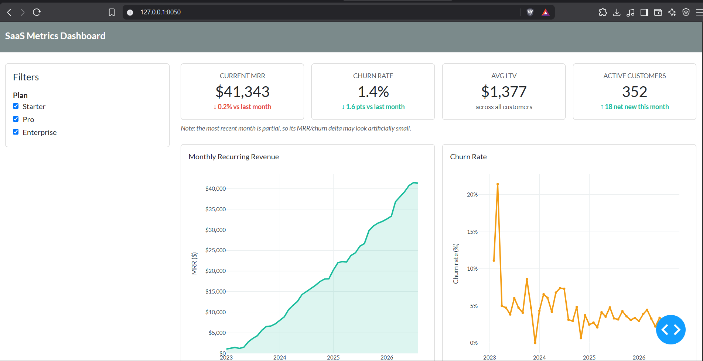

# SaaS Metrics Dashboard

A lightweight, local, open-source BI dashboard for SaaS metrics — built with Python, Dash, DuckDB, and Plotly. No cloud account, no subscription, no enterprise BI license. Clone it, generate some data (or plug in your own), and you have a working analytics tool in minutes.



## Why this exists

Enterprise BI tools like Tableau or Power BI are powerful, but overkill for a small SaaS business or an indie hacker who just wants to see MRR, churn, and retention without signing up for anything. This project shows that a genuinely useful, good-looking analytics dashboard can be built entirely with free, open-source tools, running locally on your own machine.

## Features

- **MRR (Monthly Recurring Revenue)** trend chart, filterable by pricing plan
- **Churn rate** trend, month over month
- **LTV (Lifetime Value)** per customer and average across the business
- **Cohort retention** analysis (query included; chart coming in a future release — see Roadmap)
- Month-over-month deltas on every KPI card, color-coded (green = good, red = bad)
- A realistic synthetic data generator, so the dashboard is populated with a believable 3+ year business history out of the box

## Tech stack

| Layer | Tool |
|---|---|
| Frontend / interactivity | [Dash](https://dash.plotly.com/) + [Dash Bootstrap Components](https://dash-bootstrap-components.opensource.faculty.ai/) |
| Charts | [Plotly](https://plotly.com/python/) |
| Database | [DuckDB](https://duckdb.org/) (local, file-based, fast analytical queries) |
| Data generation | [Faker](https://faker.readthedocs.io/) |
| Data wrangling | [pandas](https://pandas.pydata.org/) |

## Quick start

```bash
# 1. Clone the repo
git clone https://github.com/RiyaSingla08/saas-metrics-dashboard.git
cd saas-metrics-dashboard

# 2. Create and activate a virtual environment
python -m venv venv
source venv/bin/activate        # Mac/Linux
# venv\Scripts\activate         # Windows (Command Prompt/PowerShell)
# source venv/Scripts/activate  # Windows (Git Bash)

# 3. Install dependencies
pip install -r requirements.txt

# 4. Build the database schema
python scripts/init_db.py

# 5. Generate realistic synthetic data (~600 customers, 3+ years of history)
python scripts/generate_data.py

# 6. Run the dashboard
python -m app.main
```

Then open **http://127.0.0.1:8050** in your browser.

## Using your own data

The synthetic data generator is a stand-in — the whole point of this project is that it's easy to swap in real data. As long as your data fits the schema in `sql/schema.sql` (`customers`, `plans`, `subscriptions`, `payments`), every query and chart will work unchanged. Write your own loading script that populates those four tables from your actual billing system export (Stripe, Chargebee, etc.), skip `scripts/generate_data.py`, and everything downstream just works.

## Project structure

```
saas-metrics-dashboard/
├── app/
│   ├── main.py          # Dash app entry point
│   ├── layout.py        # page structure: navbar, sidebar, KPI cards, chart containers
│   ├── callbacks.py      # interactivity: filters -> recalculated KPIs and charts
│   ├── charts.py         # Plotly figure-building functions
│   └── queries.py        # Python wrappers around the SQL metric queries
├── sql/
│   ├── schema.sql         # table definitions
│   └── metrics_queries.sql # standalone copies of the four core metric queries
├── scripts/
│   ├── init_db.py         # builds the DuckDB database from schema.sql
│   ├── generate_data.py   # synthetic data generator
│   └── test_queries.py    # sanity-checks all four metric queries against the data
├── data/
│   └── saas_metrics.duckdb # the database file (generated, not hand-edited)
├── docs/
│   └── dashboard-screenshot.png
├── requirements.txt
├── LICENSE
└── README.md
```

## The metrics, explained

- **MRR** — sum of revenue actually collected (`payments.amount`) in a given month. Simple by design: it reflects money that came in, not what was theoretically owed.
- **Churn rate** — (customers who churned during a month) ÷ (customers active at the start of that month). Calculated per month from the `subscriptions` table's status history.
- **LTV** — total revenue collected from a customer across their entire history with the business.
- **Cohort retention** — customers grouped by signup month, tracking what percentage of each cohort is still active N months later. The query lives in `sql/metrics_queries.sql`; a heatmap visualization is on the roadmap.

## Roadmap

- [ ] Cohort retention heatmap chart
- [ ] Date-range filter (currently the dashboard shows full history)
- [ ] Export to CSV/PDF from the dashboard itself
- [ ] Docker setup for one-command deployment
- [ ] Optional Stripe API import script

Contributions on any of these (or anything else you think would help) are welcome — see [CONTRIBUTING.md](CONTRIBUTING.md).

## License

MIT — see [LICENSE](LICENSE). Use this however you'd like.
